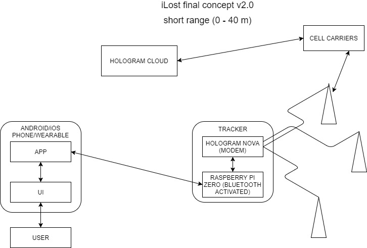
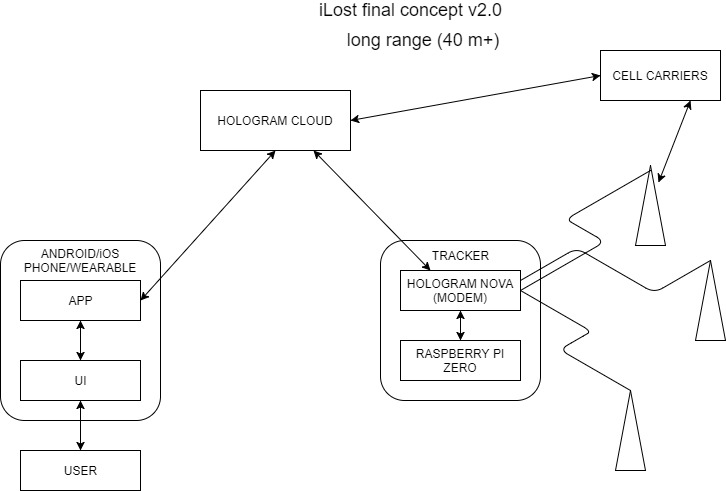
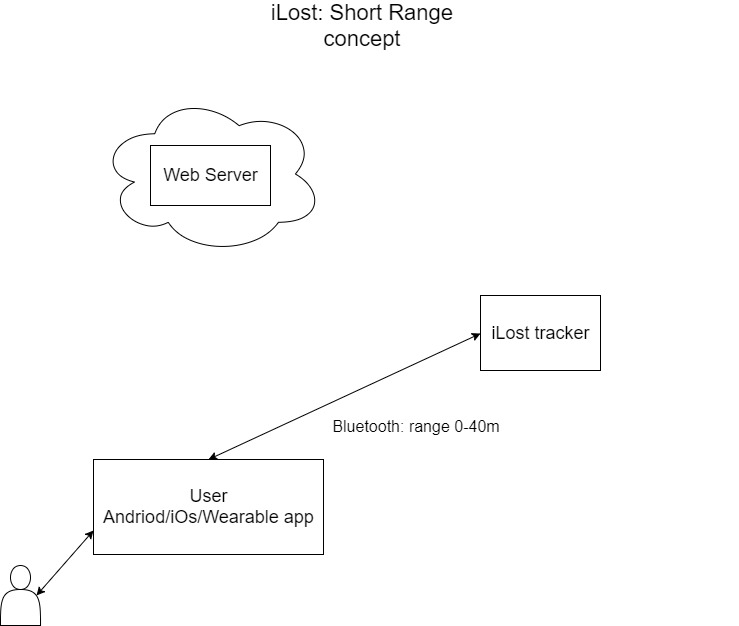
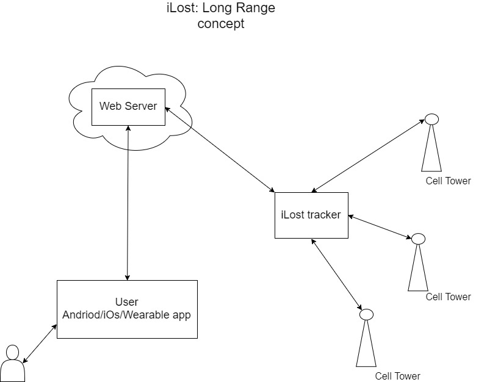

# Diagrams
## Final Concept Diagram v2.0

## Final Concept Diagram v1.0

## User Case Diagram (Normal Use Case)

## Sequence Diagram (Normal Use Case)

## Activity Diagram (Normal Use Case)

## Architecture Functional Diagram

