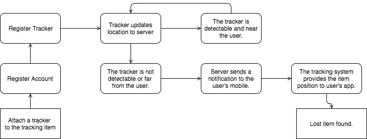

# Technical Architecture

## Logical view: 

* Abstraction of object classes
* UML

## Physical view: 	

* How the system hardware and software components are distributed across the processors in the system.
* Layered 

## Development view: 

* How the software is decomposed for development 
* MVC

## Process view: 	

* How the system is composed of interacting processes.
* Pipe and filter

## Application Architecture

* Transaction processing system
* Information systems architectue

---

[Diagrams Source Code](https://drive.google.com/file/d/1vl52OwYYfEFQROcuIXDE3dvN_VLhNvnk/view?usp=sharing)