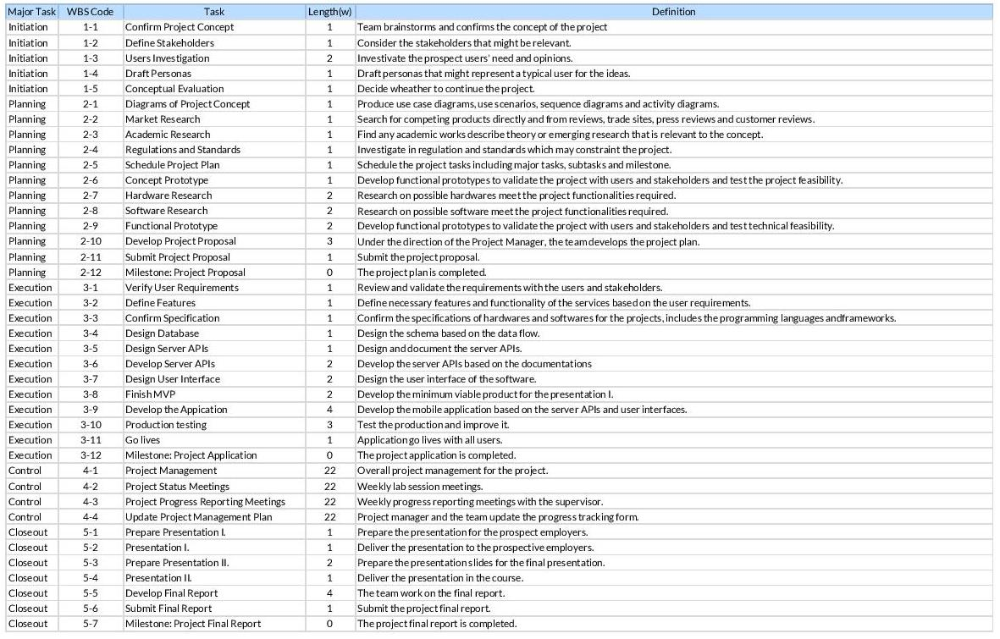
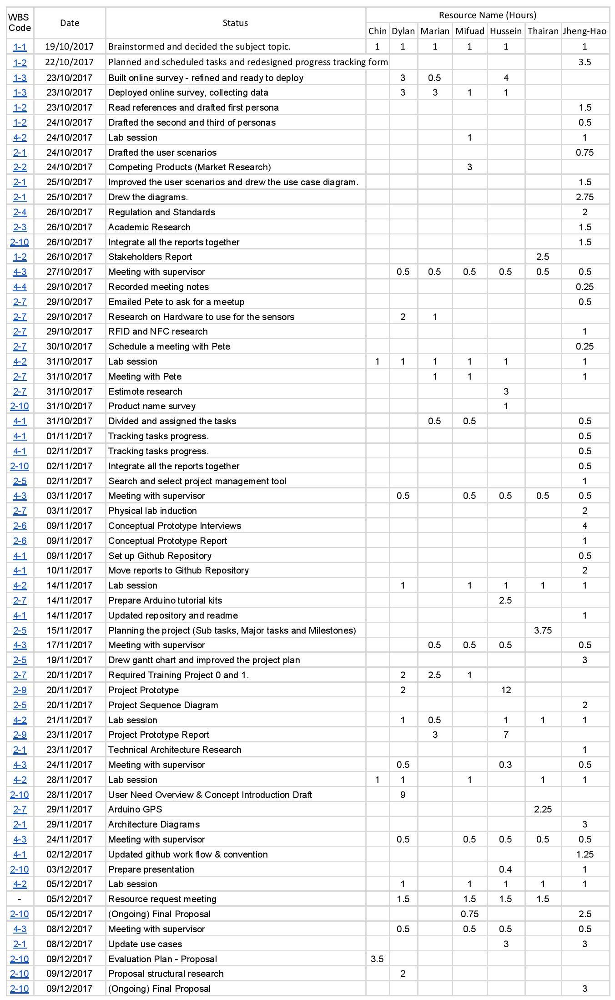
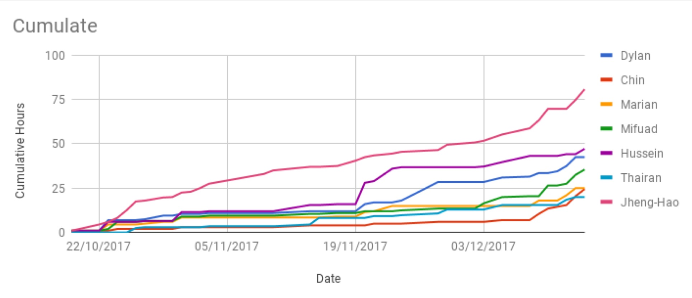
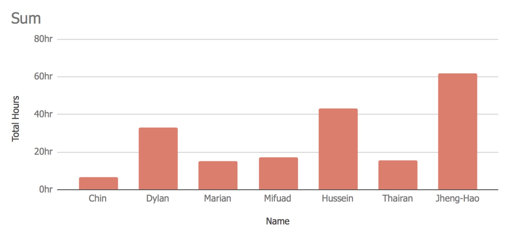

# 12.Appendices

# 1. User Need Overview & Concept Introduction

---

# 2. Data gathering and requirements

---

# 3. Functional Specification

---

# 4. Ethical audit 

---

# 5. Design

---

# 6. Prototyping

---

# 7. Technical Architecture

---

# 8. Evaluation Plan

---


---

# 9. Project management

## 9-1 Project Tasks List


## 9-2 Meeting notes

### Supervised Meeting - 7/12/2017

* Walked through the proposal requirements.
* Tim suggested us to 
	* Build a wood made tracker as a physical usage prototype to test the usage of our tracker. 
	* Add extreme tests in the evalutaion section

### Lab Meeting - 5/12/17 

* Have asked hatchlab about purchasing hologram.
* Need to buy hologram on our own.
* Discuss what to do during the Christmas break on 12/12.

### Supervised Meeting - 30/11/2017

* Grilled over the technical diagrams.
* We need to catch up on hours.
* Tim likes our project.

### Supervised Meeting - 24/11/2017

* Tim said: "Where are the prototypes???" 
* The meeting time has now changed to Thursday 12:00.
* Suggestion: 
	* Separate the process diagram into different part to fit them in the proposal.

### Lab Meeting - 21/11/2017

* How to integrate Skyhoot:  @hussein159 works on that.
* Platform: Android
* Functional Prototype: @hussein159 works on that.
* To put data privacy issue in proposal while using the skyhook or any cloud service.

### Supervised Meeting - 17/11/2017

* Updated progress tracking form with milestone / tasks.
* People who commit more will have more marks, please record your effort on the progress tracking form and proactively pick the tasks if you need more marks.
* Changing time of the meeting may be quite difficult.
* Tim suggested to host another meeting time during the week apart from the lab.

### Supervised Meeting - 03/11/2017

* What we've done:
	* Meeting with Pete.
	* Hardware research.
	* About to attend the hatch lab induction.

* What we have not done:
	* Improve the previous report.
	* Estimote testing report.

### Meeting with Pete - 31/10/2017

* To discuss: 
	* Anyway to improve on our idea?
	* Any suggestion on the hardware?
	* How to compete with competing products?


### Supervised Meeting - 27/10/2017

* Try to build a prototype before next meeting.
* Search what's the techniques the existing products use.
* Search what can we use to provide the service.
* Because of age-related memory loss, the elders or middle age people could be our target customers.


### Supervised Meeting - 20/10/2017

* Progress suggestions
	* Before next week: potential user (Draft personas?)
	* Setup a questionnaire to ask who are our users? 

* Preparing for next time:
	* Bring the lab doc / track form (hard copy of the progress sheet).
	* Sketch Functional Architecture 
	* Make sure the requirements are met before next week.
	* Use case senario.
	* Completed resource form.
	* Do the questionnaire in: 
	  * Cafeteria
	  * Costa
	  * Family
	* Think about project names?


### Extra Meeting - 19/10/2017

* Topic decided: **Lost item tracker**
* Product name
	* findME
	* BlueJ
	* locate.
	* Lost.
	* LocationRanger


## 9-3 Progress Tracking Form (until 10/12)



## 9-4 Progress Tracking Charts (until 10/12)

### Cumulate Line Chart



### Sum Column Chart



## 9-5 Github Directories

* `/documents`: The reports for each week progress.
* `/proposal`: Paragraphs for each section of our first report
* `/src`: software/hardwares source code.
* `/presentations`: Slides for the presentation in March.
* `/final-report`: Paragraphs for the final report.

## 9-6 Github Work Flow

If you want to update any document or source code in the repository, please follow **the work flow** and the **naming convention** to maintain the consistency.

### tl:dr

1. [Issue](#1issue)
1. [Branch](#2-1-check-out-the-branch)
1. [Work](#3-work)
1. [Commit](#4-commit)
1. [Push & pull request](#5-push-pull-request)

### 1.Issue

Before you start to work on either document or source code, make sure you **browse the issue section** to see if there is already an existing issue related to what you're going to work on. If you found one, than go to [step 2-1](#2-1-check-out-the-branch). 

If there is no such issue you're looking for, **create a new one then**. Condense the title and add more details in the description. Add the correct label to it and assignees as well. 

> [Read more about the issue labels](#issue-labels)

### 2-1. Check out the branch

Check out the corresponding branch on your local working space. If the issue you found is `#13`, then the branch name should be like `issue-#13-xxxx`. `xxxx` can be `fix` or `update`.

### 2-2. Create a new branch based on that issue.

If you can't find the issue about what you need to work on, create a new one on your own. Here is the naming convention:

`issue-#[ISSUE NUMBER]-[ACTION]`

* NUMBER: the number of the corresponding issue.
* ACTION:
  * `update`: for report updating or feature updating, mainly for something continuously updating.
  * `fix`: for fixing a bug or typo, mainly for something happen one time only.

### 3. Work

As title, work on your branch and make sure you're on the right branch already. You can use `git branch` to check it.

### 4. Commit

To commit, here is the commit message:

```
[TYPE]: [SUBJECT LINE]

[DESCRIPTION]

[ACTION] #[ISSUE NUMBER]
```

* `TYPE`: `Update` or `Fix`. same as the `ACTION` on the branch name
  * `Update`: for report updating or feature updating, mainly for something continuously updating.
  * `Fix`: for fixing a bug or typo, mainly for something happen one time only.
* SUBJECT LINE: briefly describe your changes. 
* DESCRIPTION: describe the change in more details.
* ACTION: 
  * `Close`: to close of the branch and the issue forever (theoretically).
  * `Update`: there should be future updating continuously.
* ISSUE NUMBER: the issue number.

#### e.g. Update the report 

```
Update: Rewrite the project concept.

Condense the project concept and add two new diagrams.

Closes #1234
```

#### e.g. Fix a bug

```
Fix: Added missing header

The app header was deleted accidently, added it back.

Closes #12345
```

> Please review your change before every commit, which will massively reduce the possibility of finding bugs or typos after push the commit.

### 5. Push & pull request

After you push your commit, make a pull request on Github. Everyone can review your change and add comment. After reviewing I will either merge it to the master or ask you to do some change.

### Issue labels

Here are the categories of the issue labels, one issue can be assigned **one or more** labels.

|     Label Name     |                                      Description                                       |
| ------------------ | -------------------------------------------------------------------------------------- |
| final report       | related to final report.                                                               |
| enhancement        | software functionality enhancement.                                                    |
| bug                | software bugs.                                                                         |
| hardware           | hardware related.                                                                      |
| presentation       | related to the presenation.                                                            |
| project management | anything related to the project magement                                               |
| proposal           | related to the proposal content.                                                       |
| weekly documents   | weekly unsorted records.                                                               |
| report             | anything related to text, including `final report`, `proposal` and `weekly documents`. |

---

# 10. Conclusion
