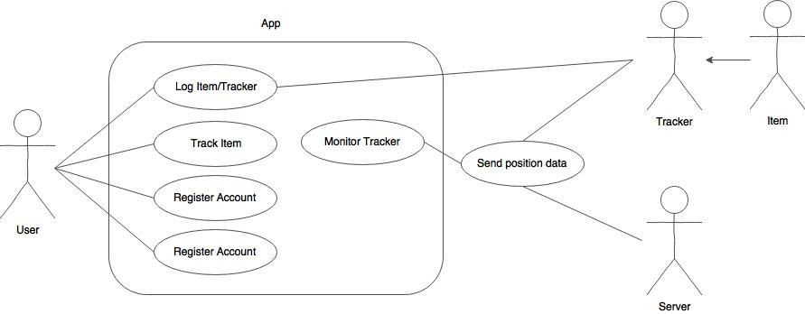
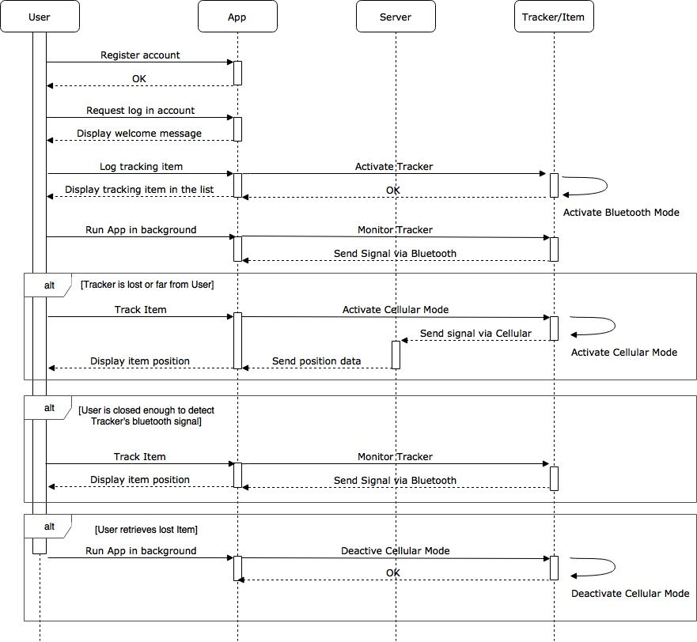
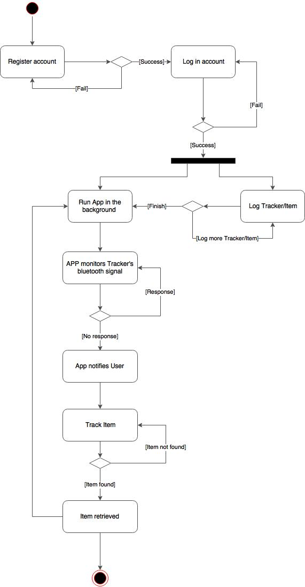
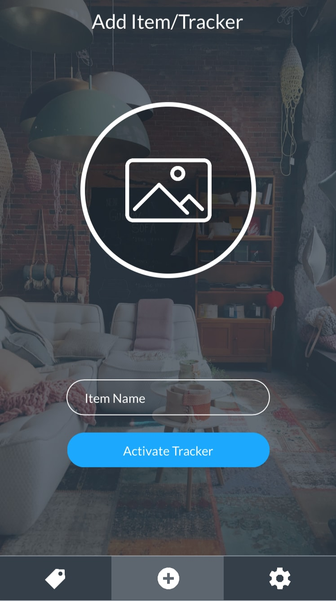
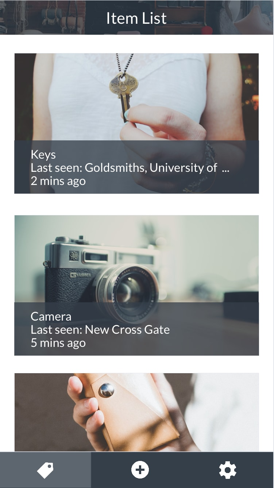
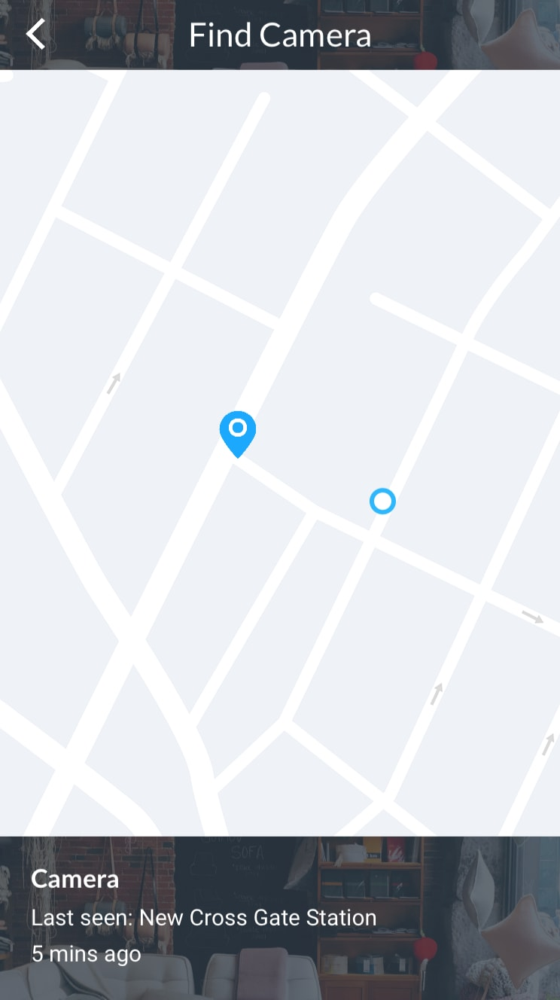
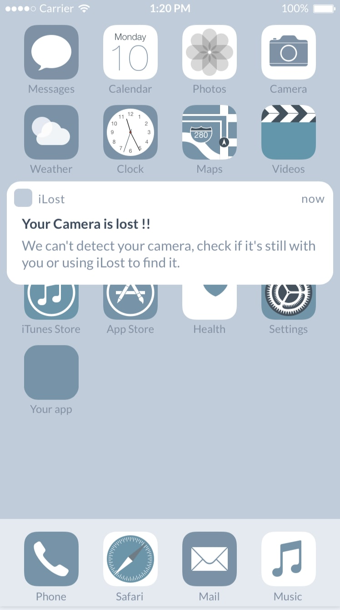
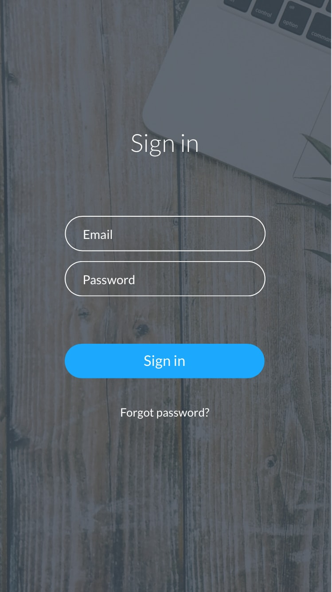
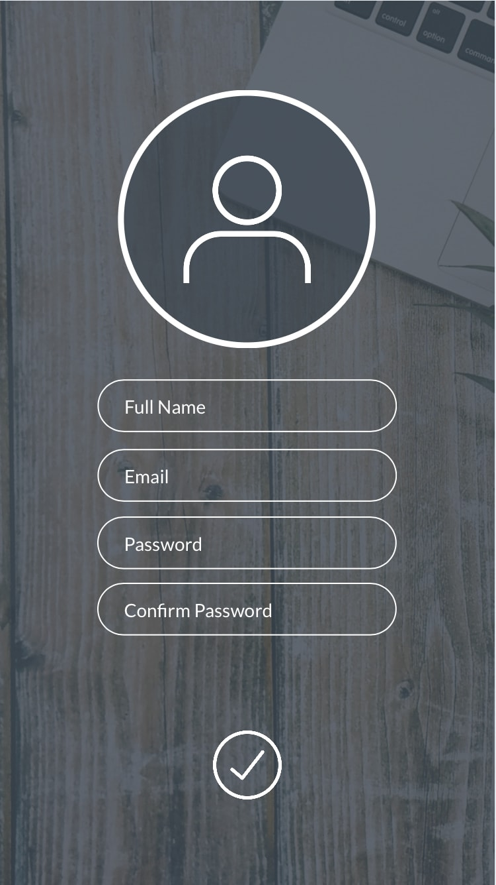

# 5.Design

We have six basic use cases which contain five use case actors. These use cases cover all the services our service could provide for the users, which enable us to develop the use case diagram, sequence diagram and activity diagram.

## Use Case Actors

Name | Description
|---|---|
User | The user who uses our service.
App | The iLost mobile application that User interacts with.
Server | Hologram Cloud APIs, which provides the geolocation of the Tracker.
Tracker | Physical tracker attaching to the user's item(s), a raspberry pi and a GPS module are built-in.
Item | User's personal belonging which is desired to be tracked.

## Use Case Index

Use Case ID| Use Case Name | Primary Actor | Description
|---|---|---|---|
1 |Log Tracker | User | User logs the Tracker into App.
2 |Monitor Tracker | App | App listens to the signal of Tracker.
3 |Track Item | User | User uses App to track their item.
4 |Send position data | Tracker | Tracker sends position data.
5 |Register account | User | User register a new account in App.
6 | Login account | User | User login to account in App

Please find the details of each use case flow in appendices 5-1.

## Use cases diagrams

The use case diagram visualises the relationship between these five actors and the use cases.

## Sequence Diagram

The sequence diagram demonstrates the relationship and data flow of each use case.

## Activity Diagram

The activity diagram shows the basic usage flow for the sunny day use scenario.

## User Interface

We prototyped the wireframe and user interface base on the use cases, provided a [live prototye](https://marvelapp.com/48da709) to test the usability of our design. In the proposal stage, the application provides the basic functionalities to fulfil the user needs. The user interface is listed below and sorted in usage frequency and importance.

### Uesr Interface Index

|ID | Name | Functionality | For Use Case |
|---|---|---|---|
| 1 | Log Item | Log new item and Tracker to App. | Log Tracker
| 2 | Item List | Display the list | Track Item
| 3 | Track Item | Show the item's position on the map. | Track Item
| 4 | Notification | App notify User Item is lost | Monitor Tracker
| 5 | Welcome | Introduce our app to the user | Login account.
| 6 | Login account| Allow User to login account. | Login account
| 7 | Register account | User registers a new account. | Register account

### 1. Log Item

### 2. Item List

### 3. Track Item

### 4. Notification

### 5. Welcome

### 6. Login account

### 7. Register account

