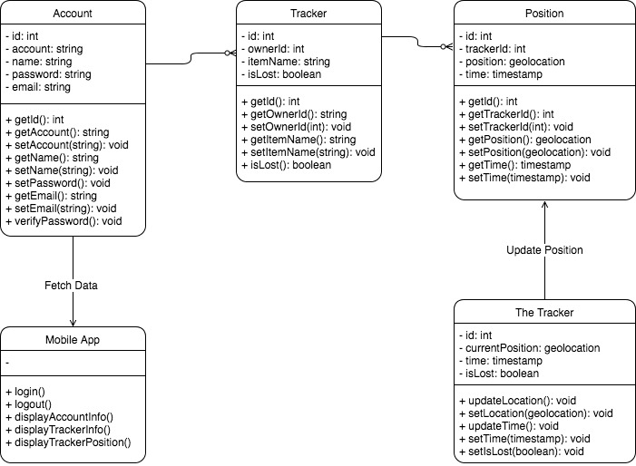
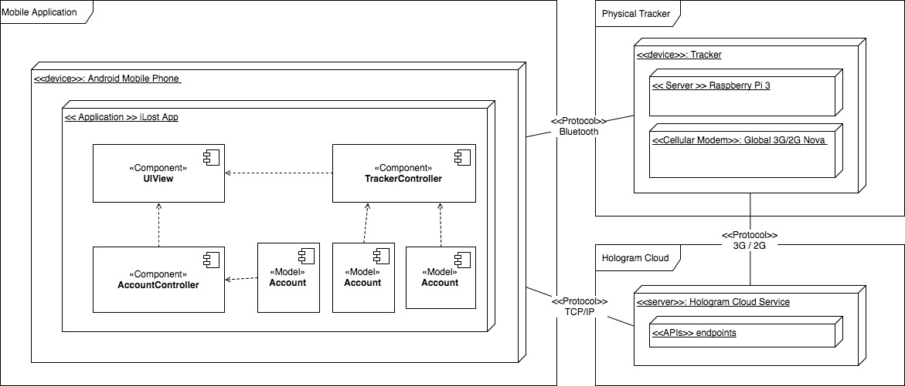
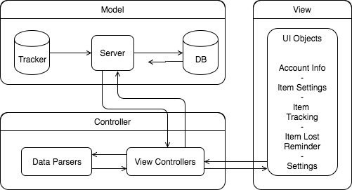

# 7.Technical Artichitecture

> Having validated the proposed solution with users and answered any open technical or feasibility questions, attribute specific technologies to the functional architecture and present this as a technical architecture.
> Justify your choice of technologies with reasoned arguments for rejecting or retaining alterative technologies

After several technical testing and prototyping, we decided to integrate Hologram Cloud as our server provider, which provides various built-in functions and allows us to focus on developing the mobile application and the tracker. Due to the privacy issue, our app doesn't store any data in the cloud server or database but in the user's mobile phone only. This simplifies our original technical architecture while keeping the same functionalities.

To present our technical architecture, we provided four kinds of views and different types architecture diagram.  

| View | Diagram Type | Description |
|---|---|---|
| Logical view | UML | Abstraction of object classes
| Physical view | Layered | How the system hardware and software components are distributed across the processors in the system.
| Development view | MVC | How the software is decomposed for development
| Process view | Pipe and filter | How the system is composed of interacting processes.

## Logical View

## Physical View

## Development View

The MVC model fits our application which will focus on displaying data of the item's position and monitoring the signal from the tracker(s). There is no any complicated computing involved and which simplifies our application development.

## Process View

