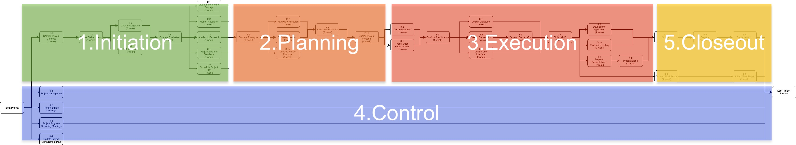
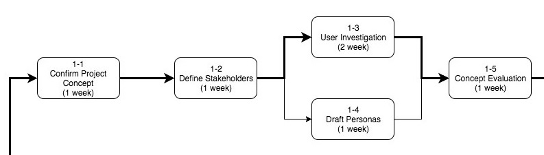
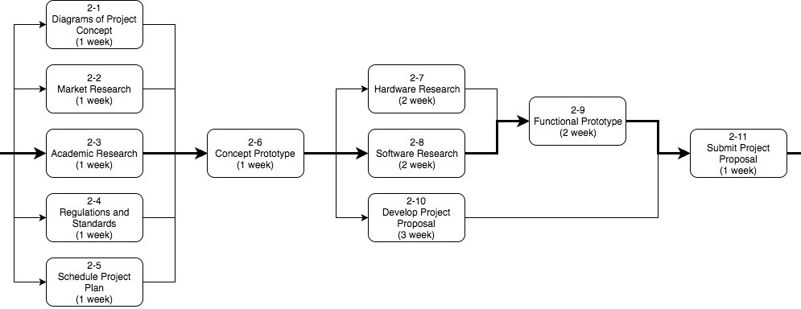
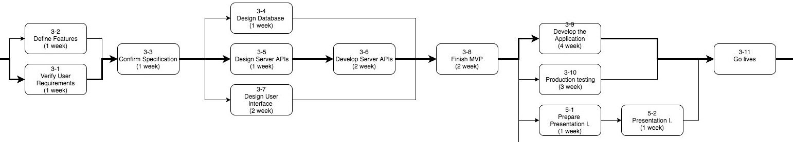
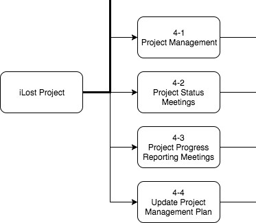
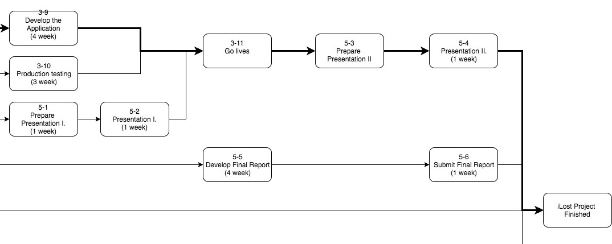

# 9. Project Management

## Project Cycle

Our project cycle contains five process groups[1] and three milestones at the end of some of the developing process. "Initiation" and "planning" two stages are before the proposal submission, "execution" is for developing the actual product, "control" is for project management and "closeout" is the for the final presentation and report.

### Stage descriptions

Stage| Description
|---|---|
|Initiation|Confirming the project concept, personas and user needs.|
|Planning|Researching technology and developing the proposal.|
|Execution|Developing the minimum viable product and final production.|
|Control|Project management and the weekly meetings.|
|Closeout|Developing presentation and final report.|

### Milestones

Milestone Name | Stage
|---|---|
Project Proposal | End of Planning
Project Application |  End of Execution
Project Final Proposal | End of Closeout

### 1. Initiation

### 2. Planning

### 3. Execution

### 4. Control

### 5. Closeout

More details of the tasks and milestone are in the appendices 9-1.

## Gantt Chart

Using a week as a minimum developing unit to measure and schedule the developing process is more feasible than using day and more preciser than using a month.

Our weekly routine and meeting notes are in the appendices 9-2

## Project Management Tools

Slack, Trello, Google Spread Sheet and Github are our main project management tools to fulfil various developing needs. After using Github to record our weekly reports and cooperate on proposal, it's not necessary to use Trello. Github has the features we need from Trello, so we are considering to replace Trello with it completely in the next stage. 

Full progress tracking form can found in appendices 9-3 and 9-4.
More details about how we utilise all the tools and workflow are in appendices 9-4, 9-5 and 9-6.

## Roles

There are only two types of roles: project manager and project team member. Still it's inevitable for the project manager to do the same duties as the project member.

More details about the roles are in appendices 9-7.