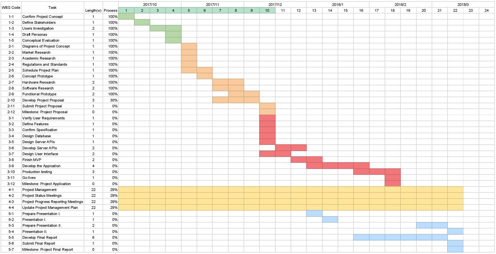
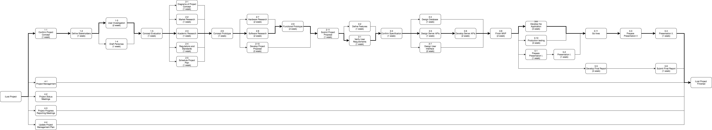
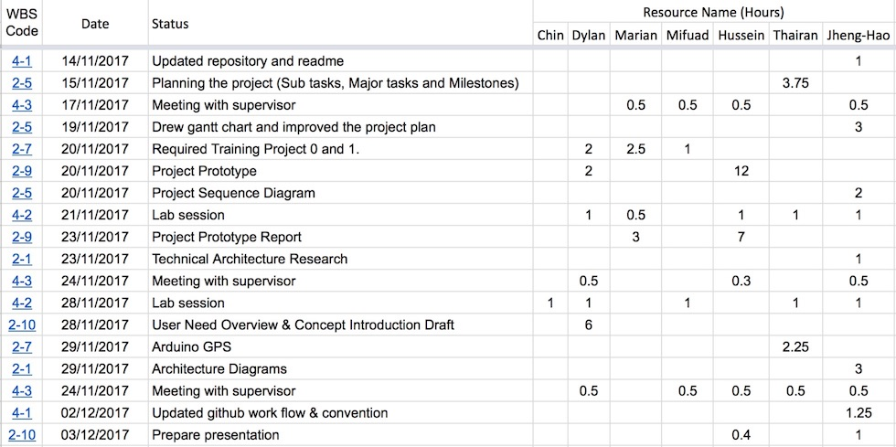

# 9.Project Management

## Projcet Cycle

Our project cycle contains five process groups of Initiation, Planning, Execution, Control, Closeout[1].

* Initiation: confirming the project concept, personas and user needs.
* Planning: researching technology and developing proposal.
* Execution: developing the minimum viable product and final production.
* Control: project mangement and weekly meeting.
* Closeout: developing presenation and final report.

There are three mile stones in the project cycle:

Milestone Name | Description | Stage
|---|---|---|
Project Proposal | After submmition of the project proposal. | End of Planning
Project Application |  Finish the application production. | End of Execution
Project Final Proposal | After submmition of the project final proposal. | End of Closeout

Please find more details of the tasks and milestone in the appendices 9-1.

## Gantt Chart and Project Diagram

With the project tasks sheet and estimated developing duration, we produce the gantt chart and the developing diagram, which allow our team mates to see the developing progress clearly and easily.

### Gantt Chart

### Project Diagram

## Weekly Routine

We use a week as a minimum developing unit to measure and schedule the developing process, which is more feasible than using day and preciser using month. There are two working slots and two meeting weekly.

|Time| Task | Task Description | Total Duration |
|---|---|---|---|
Tuesday Morning | Lab Meeting | Report everyone's previous workig status and plan for the Indivisual Working Slot 1. | 1 hour
Tuesday to Thursday | Indivisual Working Slot 1 | Working on the plan discussed on Lab Meeting. | 4 hours
Friday Noon | Supervised Meeting | Report the working result and consult to the supervisor. | 0.5 hour
Friday to Monday | Indivisual Working Slot 2 | Improve one the working result based on the Supervised Meeting. |  4 hours

The meeting notes can be found in the appendices 9-2

## Progres Tracking Form

In order to track the resource usage easily, we implement Google spread sheet, which allows our group mates to record their efforts and categorise the their working status.

Label Name | Description
|---|---|
WBS Code | Work break down code, which indicates the category of the work for.
Date | The working date.
Status | The detail of the work.
Resource Name(hour) | Usage of the resource(s) in hours.

We also make a chart develop a line chart and a column chart, which visualise the statics automatically based on the resource usage.

Please read find the full progress tracking form and charts in appendices 9-3 and 9-4. 

## Project Management Tools

Slack, Trello, Google Spread Sheet and Github are our main project management tools to fullfill various developing needs.

|Platform|Functionality
|---|---|
Slask | Inner communication.
Trello | Divides and assigns weekly tasks. (depreciated)
-  | Records weekly meeting notes.
Google Spread Sheet| Progress tracking form.
 - | Gantt Chart.
 - | Project Tasks List.
Github | Manage source code and report with fixed work flow.
- | Use issue feature to track developing progress.
- | Record weekly reports.

After start using Github to record our weekly reports and cooperate on proposal, the necessity of using Trello is redecuded. Becasue Github has most of the featuers we need from Trello, such as lists, labels, and milestones are all on Github, Trello may be replaced by it completely.

We have setup a specific work flow and standard to maintain our commitment format and readibility. Please find more details about Github repository and work flow in appendices 9-5 and 9-6.
